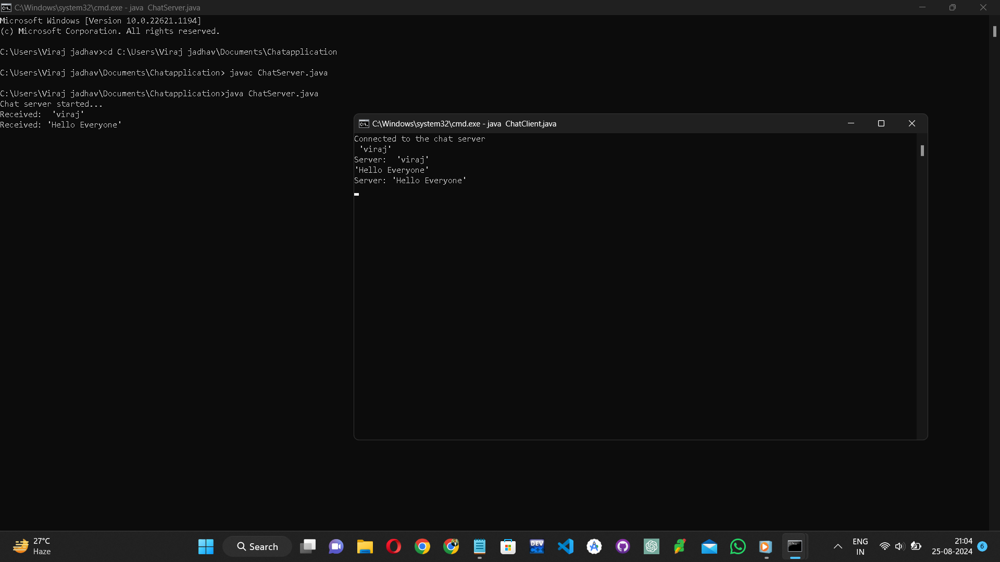

# java chat Application

This is a simple text-based chat application implemented in Java. The application consists of a ChatServer that handles client connections and multiple ChatClient instances that can connect to the server to exchange messages.

The server and clients can run on different devices, allowing users to chat over a local network or the internet.

> Features
Multi-client support: Multiple clients can connect to the server and chat with each other.
Broadcasting: Messages sent by any client are broadcast to all connected clients.
Simple and easy to use: Command-line interface for both server and client.
Getting Started
Prerequisites
Java Development Kit (JDK) installed on all devices.
A terminal or command prompt to compile and run the code.
Project Structure

/JavaChatApplication
│
├── ChatServer.java      # Server-side code
├── ChatClient.java      # Client-side code
└── README.md            # Project documentation

> Compiling the Code
Open a terminal or command prompt.

Navigate to the directory where the project files (ChatServer.java and ChatClient.java) are located.

Compile the server and client code:

javac ChatServer.java
javac ChatClient.java

Running the Server

In the terminal or command prompt, run the server:

java ChatServer
The server will start and listen for incoming client connections on port 12345 by default.

Running the Client
Open a new terminal or command prompt on the same or a different device.

Navigate to the directory where ChatClient.class is located.

Update the server IP in ChatClient.java if running on a different device.

Run the client:

java ChatClient
The client will connect to the server, and you can start sending and receiving messages.

> Usage
Sending Messages: Simply type a message in the client terminal and press Enter. The message will be sent to the server and broadcast to all connected clients.
Receiving Messages: Messages sent by other clients will appear in your terminal.
Troubleshooting
"Address already in use" Error: This occurs if the server port is already in use. Change the port number in ChatServer.java and ChatClient.java if needed.
Connection Issues: Ensure the server's IP address and port are correctly set in ChatClient.java. Make sure firewalls and network settings allow traffic on the specified port.
Multiple Clients: Run multiple instances of ChatClient on different devices to simulate a real chat environment.
Example Workflow
Run the server: Start the ChatServer.
Connect clients: Run ChatClient on different devices.
Chat: Type messages in any client's terminal, and they will appear on all other clients' terminals.

